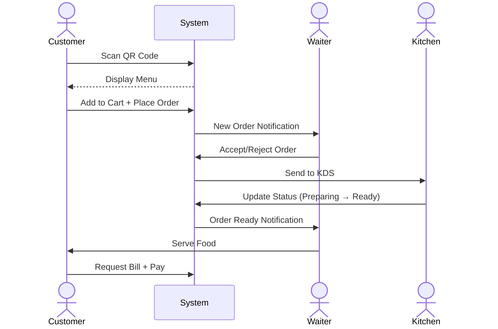

# 📋 SMART RESTAURANT - PHÂN CÔNG CÔNG VIỆC NHÓM

> **Ngày tạo:** 31/12/2024  
> **Dự án:** Smart Restaurant - QR Menu Management System  
> **Số thành viên:** 3 người  
> **Thời gian:** 6 tuần (3 sprints x 2 tuần)

---

## 📑 MỤC LỤC

1. [Tóm tắt Project Description](#1-tóm-tắt-project-description)
2. [Gap Analysis - Hiện trạng vs Yêu cầu](#2-gap-analysis---hiện-trạng-vs-yêu-cầu)
3. [Phân công Task cho 3 thành viên](#3-phân-công-task-cho-3-thành-viên)
4. [Roadmap & Implementation Guide](#4-roadmap--implementation-guide)
5. [Checklist hoàn thành](#5-checklist-hoàn-thành)

---

## 1. TÓM TẮT PROJECT DESCRIPTION

### 1.1 Tổng quan hệ thống

**Smart Restaurant** là hệ thống đặt món qua QR Code cho nhà hàng dine-in (ăn tại chỗ).

```
┌─────────────────────────────────────────────────────────────────┐
│                    SMART RESTAURANT SYSTEM                       │
├─────────────────────────────────────────────────────────────────┤
│  Customer  →  Scan QR  →  View Menu  →  Order  →  Pay          │
│      ↓                                      ↓                    │
│  Waiter accepts/rejects  ←──────────────────┘                   │
│      ↓                                                          │
│  Kitchen receives & prepares  →  Waiter serves  →  Complete     │
└─────────────────────────────────────────────────────────────────┘
```

### 1.2 Technology Stack

| Layer | Technology |
|:------|:-----------|
| **Architecture** | Single Page Application (SPA) |
| **Frontend** | ReactJS + Vite + TypeScript |
| **Backend** | NestJS (NodeJS) |
| **Database** | PostgreSQL + Prisma ORM |
| **Authentication** | Passport.js + JWT |
| **Payment** | ZaloPay / MoMo / VNPay / Stripe |
| **Real-time** | Socket.IO / WebSocket |
| **Caching** | Redis (optional) |

### 1.3 User Roles

| Role | Mô tả | Quyền hạn |
|:-----|:------|:----------|
| **Super Admin** | Quản trị viên hệ thống | Tạo/quản lý Admin accounts |
| **Admin** | Chủ nhà hàng | Quản lý menu, bàn, nhân viên, báo cáo |
| **Waiter** | Nhân viên phục vụ | Duyệt đơn, phục vụ, quản lý bàn |
| **Kitchen Staff** | Nhân viên bếp | Xem đơn trên KDS, cập nhật trạng thái |
| **Guest** | Khách chưa đăng ký | Quét QR, xem menu, đặt món |
| **Customer** | Khách đã đăng ký | Như Guest + lịch sử đơn hàng |

### 1.4 Luồng hoạt động chính



### 1.5 Core Features

#### Customer-Facing (Dine-in)
- ✅ QR code menu access (table-linked)
- ⏳ Menu browsing with filters and search
- ❌ Shopping cart with modifiers
- ❌ Add items to current order
- ❌ Real-time order tracking
- ❌ Request bill + Payment

#### Waiter Interface
- ❌ Real-time notifications
- ❌ View pending orders by table
- ❌ Accept/Reject orders
- ❌ Mark orders as served

#### Restaurant Admin
- ✅ Menu management (categories, items, modifiers)
- ✅ Table and QR code management
- ❌ Order management with KDS
- ❌ Revenue reports and analytics
- ❌ Staff account management

#### Advanced Features
- ❌ Kitchen Display System (KDS)
- ❌ Real-time WebSocket updates
- ❌ Fuzzy search for menu items
- ❌ Multi-language support (EN/VI)
- ❌ Payment gateway integration

---

## 2. GAP ANALYSIS - HIỆN TRẠNG VS YÊU CẦU

### 2.1 Những gì ĐÃ CÓ ✅ (~30%)

#### Backend (NestJS)

| Module | Files | Endpoints | Trạng thái |
|:-------|:------|:----------|:-----------|
| **Tables** | `tables.controller.ts`, `tables.service.ts` | CRUD, filter, status | ✅ Complete |
| **QR Token** | `qr-token.controller.ts`, `qr-token.service.ts` | Generate/Regenerate JWT | ✅ Complete |
| **QR Export** | `qr-export.controller.ts`, `qr-export.service.ts` | PDF/PNG/ZIP download | ✅ Complete |
| **Categories** | `categories.controller.ts`, `categories.service.ts` | CRUD, status, sort | ✅ Complete |
| **Menu Items** | `menu.controller.ts`, `menu.service.ts` | Basic list with filters | ⚠️ Partial |
| **Modifiers** | `modifier-groups.controller.ts` | Groups + Options CRUD | ✅ Complete |
| **Menu Photos** | `menu-photos.controller.ts` | Upload/Delete/Set Primary | ✅ Complete |
| **Prisma** | `prisma.service.ts`, `schema.prisma` | Tables, Menu, Modifiers | ✅ Complete |

#### Frontend (React + Vite)

| Page | File | Chức năng | Trạng thái |
|:-----|:-----|:----------|:-----------|
| **Table Management** | `TableManagement.tsx` | CRUD bàn, QR generation, filters | ✅ Complete |
| **Categories** | `CategoriesManagement.tsx` | CRUD categories | ✅ Complete |
| **Modifiers** | `ModifiersManagement.tsx` | Groups + Options management | ✅ Complete |
| **Customer Menu** | `Menu.tsx` | View menu from QR scan | ⚠️ Basic |

#### Database Schema (Prisma)

```prisma
✅ Table          - id, table_number, capacity, location, status, qr_token
✅ MenuCategory   - id, name, description, display_order, status
✅ MenuItem       - id, name, description, price, category, status, photos
✅ MenuItemPhoto  - id, url, is_primary
✅ ModifierGroup  - id, name, selection_type, min/max_selections
✅ ModifierOption - id, name, price_adjustment
```

### 2.2 Những gì CHƯA CÓ ❌ (~70%)

#### 🔴 Priority: CRITICAL

| Module | Mô tả | Độ phức tạp | Effort |
|:-------|:------|:------------|:-------|
| **Authentication** | JWT + Passport.js, Login/Register, Guards | High | 2 tuần |
| **User Management** | CRUD users, role assignment | Medium | 1 tuần |
| **Order System** | Cart, Order creation, Order items | High | 2 tuần |

#### 🟠 Priority: HIGH

| Module | Mô tả | Độ phức tạp | Effort |
|:-------|:------|:------------|:-------|
| **Waiter Flow** | Accept/Reject, Notifications | Medium | 1 tuần |
| **KDS (Kitchen)** | Order queue, Status updates | Medium | 1 tuần |
| **WebSocket** | Socket.IO real-time events | High | 1.5 tuần |

#### 🟡 Priority: MEDIUM

| Module | Mô tả | Độ phức tạp | Effort |
|:-------|:------|:------------|:-------|
| **Payment** | ZaloPay/MoMo/Stripe integration | High | 2 tuần |
| **Analytics** | Revenue reports, Order stats | Medium | 1 tuần |

#### 🟢 Priority: LOW

| Module | Mô tả | Độ phức tạp | Effort |
|:-------|:------|:------------|:-------|
| **Multi-language** | i18n (EN/VI) | Low | 3 ngày |
| **Fuzzy Search** | Full-text search | Low | 2 ngày |
| **Redis Cache** | Performance optimization | Medium | 3 ngày |
| **Docker/CI-CD** | Containerization, automation | Medium | 3 ngày |

### 2.3 Tổng kết Gap Analysis

```
┌────────────────────────────────────────────────────────────────┐
│                    PROJECT COMPLETION STATUS                    │
├────────────────────────────────────────────────────────────────┤
│                                                                 │
│  ██████████░░░░░░░░░░░░░░░░░░░░  30% Complete                  │
│                                                                 │
│  ✅ Done:      Tables, QR, Categories, Modifiers, Basic Menu   │
│  ⏳ In Progress: Menu Items UI                                  │
│  ❌ Todo:      Auth, Orders, Waiter, KDS, Payment, Analytics   │
│                                                                 │
└────────────────────────────────────────────────────────────────┘
```

---

## 3. PHÂN CÔNG TASK CHO 3 THÀNH VIÊN

### 3.1 Tổng quan phân công

| Thành viên | Vai trò | Focus Area |
|:-----------|:--------|:-----------|
| **Member 1** | Backend Lead | Auth, Users, Orders, Payment APIs |
| **Member 2** | Frontend Admin Lead | Admin Dashboard, Waiter UI, Reports |
| **Member 3** | Frontend Customer Lead | Cart, Order Flow, KDS, WebSocket |

### 3.2 Sprint Timeline

```
┌─────────────────────────────────────────────────────────────────┐
│                         6-WEEK TIMELINE                          │
├─────────────────────────────────────────────────────────────────┤
│                                                                  │
│ SPRINT 1 (Week 1-2): Foundation                                  │
│ ├── Backend: Authentication & User Management                    │
│ ├── Admin: Login UI + Menu Items Management                      │
│ └── Customer: Enhanced Menu + Cart System                        │
│                                                                  │
│ SPRINT 2 (Week 3-4): Core Features                               │
│ ├── Backend: Order System + Waiter/Kitchen APIs                  │
│ ├── Admin: Waiter Dashboard + Order Management                   │
│ └── Customer: Order Flow + WebSocket Real-time                   │
│                                                                  │
│ SPRINT 3 (Week 5-6): Advanced & Polish                           │
│ ├── Backend: Payment Integration + Analytics APIs                │
│ ├── Admin: Reports Dashboard + Multi-language                    │
│ └── Customer: KDS UI + Payment Flow                              │
│                                                                  │
└─────────────────────────────────────────────────────────────────┘
```

---

### 📦 MEMBER 1: BACKEND LEAD

#### Sprint 1 (Week 1-2): Authentication & User Management

| # | Task | Story Points | Ngày | Status |
|:--|:-----|:-------------|:-----|:-------|
| 1.1 | Thiết kế schema User, Role, Session | 3 | Day 1-2 | ⬜ |
| 1.2 | Tạo Auth Module (Register/Login API) | 5 | Day 3-4 | ⬜ |
| 1.3 | Implement JWT + Passport.js Strategy | 5 | Day 5-6 | ⬜ |
| 1.4 | Tạo Guards & Role-based Decorators | 3 | Day 7-8 | ⬜ |
| 1.5 | Super Admin: CRUD Admin accounts | 3 | Day 9-10 | ⬜ |
| 1.6 | Admin: CRUD Waiter/Kitchen accounts | 3 | Day 11-12 | ⬜ |
| 1.7 | Unit tests cho Auth module | 3 | Day 13-14 | ⬜ |

**Deliverables:**
- [ ] `POST /auth/register` - Customer registration
- [ ] `POST /auth/login` - Login all roles
- [ ] `GET /auth/me` - Get current user
- [ ] `POST /users` - Create user (Admin only)
- [ ] `GET /users` - List users (Admin only)
- [ ] JwtAuthGuard, RolesGuard working

#### Sprint 2 (Week 3-4): Order System

| # | Task | Story Points | Ngày | Status |
|:--|:-----|:-------------|:-----|:-------|
| 2.1 | Schema Order, OrderItem, OrderStatus | 3 | Day 1-2 | ⬜ |
| 2.2 | Order Module: Create order from cart | 5 | Day 3-4 | ⬜ |
| 2.3 | Order items with modifiers logic | 3 | Day 5-6 | ⬜ |
| 2.4 | Order status updates API | 3 | Day 7-8 | ⬜ |
| 2.5 | Order history API | 2 | Day 9-10 | ⬜ |
| 2.6 | Waiter APIs: Accept/Reject orders | 3 | Day 11-12 | ⬜ |
| 2.7 | Kitchen APIs: Update cooking status | 2 | Day 13-14 | ⬜ |

**Deliverables:**
- [ ] `POST /orders` - Create order
- [ ] `GET /orders/:id` - Get order detail
- [ ] `PATCH /orders/:id/status` - Update status
- [ ] `POST /orders/:id/accept` - Waiter accept
- [ ] `POST /orders/:id/reject` - Waiter reject
- [ ] `GET /orders?table=X&status=Y` - Filter orders

#### Sprint 3 (Week 5-6): Payment & Analytics

| # | Task | Story Points | Ngày | Status |
|:--|:-----|:-------------|:-----|:-------|
| 3.1 | Payment module setup | 2 | Day 1 | ⬜ |
| 3.2 | ZaloPay/MoMo integration | 5 | Day 2-4 | ⬜ |
| 3.3 | Request Bill API | 2 | Day 5 | ⬜ |
| 3.4 | Payment webhook handlers | 3 | Day 6-7 | ⬜ |
| 3.5 | Analytics: Revenue APIs | 3 | Day 8-10 | ⬜ |
| 3.6 | Analytics: Order statistics | 2 | Day 11-12 | ⬜ |
| 3.7 | Documentation & Final testing | 3 | Day 13-14 | ⬜ |

**Deliverables:**
- [ ] `POST /orders/:id/request-bill` - Request bill
- [ ] `POST /payments/create` - Create payment
- [ ] `POST /payments/webhook` - Handle callback
- [ ] `GET /analytics/revenue` - Revenue reports
- [ ] `GET /analytics/orders` - Order statistics

---

### 🎨 MEMBER 2: FRONTEND ADMIN LEAD

#### Sprint 1 (Week 1-2): Auth UI & Menu Items

| # | Task | Story Points | Ngày | Status |
|:--|:-----|:-------------|:-----|:-------|
| 1.1 | Login page UI | 3 | Day 1-2 | ⬜ |
| 1.2 | Register page UI | 2 | Day 3 | ⬜ |
| 1.3 | AuthContext + Token storage | 3 | Day 4-5 | ⬜ |
| 1.4 | ProtectedRoute component | 2 | Day 6 | ⬜ |
| 1.5 | Admin Dashboard layout | 3 | Day 7-8 | ⬜ |
| 1.6 | Menu Items Management UI | 5 | Day 9-11 | ⬜ |
| 1.7 | Modifier linking + Photo upload | 3 | Day 12-14 | ⬜ |

**Deliverables:**
- [ ] `/login` - Login page
- [ ] `/register` - Register page  
- [ ] `/admin` - Dashboard with sidebar
- [ ] `/admin/menu-items` - CRUD menu items
- [ ] Photo upload working
- [ ] Modifier selection per item

#### Sprint 2 (Week 3-4): Waiter Interface

| # | Task | Story Points | Ngày | Status |
|:--|:-----|:-------------|:-----|:-------|
| 2.1 | Waiter Dashboard layout | 3 | Day 1-2 | ⬜ |
| 2.2 | Pending Orders list component | 3 | Day 3-4 | ⬜ |
| 2.3 | Order detail view | 3 | Day 5-6 | ⬜ |
| 2.4 | Accept/Reject with reason modal | 3 | Day 7-8 | ⬜ |
| 2.5 | Table assignment view | 2 | Day 9-10 | ⬜ |
| 2.6 | Real-time notification badges | 3 | Day 11-12 | ⬜ |
| 2.7 | Mark as Served flow | 2 | Day 13-14 | ⬜ |

**Deliverables:**
- [ ] `/waiter` - Waiter dashboard
- [ ] `/waiter/orders` - Pending orders
- [ ] `/waiter/tables` - Table overview
- [ ] Accept/Reject modals
- [ ] Notification badge component

#### Sprint 3 (Week 5-6): Reports & Polish

| # | Task | Story Points | Ngày | Status |
|:--|:-----|:-------------|:-----|:-------|
| 3.1 | User Management UI | 3 | Day 1-2 | ⬜ |
| 3.2 | Revenue Dashboard charts | 5 | Day 3-6 | ⬜ |
| 3.3 | Order Statistics page | 3 | Day 7-9 | ⬜ |
| 3.4 | i18n setup (EN/VI) | 3 | Day 10-11 | ⬜ |
| 3.5 | Responsive design fixes | 2 | Day 12-13 | ⬜ |
| 3.6 | UI Polish & Testing | 2 | Day 14 | ⬜ |

**Deliverables:**
- [ ] `/admin/users` - User management
- [ ] `/admin/reports` - Revenue charts
- [ ] `/admin/statistics` - Order stats
- [ ] Language switcher component
- [ ] Mobile responsive layouts

---

### 📱 MEMBER 3: FRONTEND CUSTOMER + REALTIME LEAD

#### Sprint 1 (Week 1-2): Enhanced Menu & Cart

| # | Task | Story Points | Ngày | Status |
|:--|:-----|:-------------|:-----|:-------|
| 1.1 | Enhanced Menu UI (images, badges) | 3 | Day 1-2 | ⬜ |
| 1.2 | Item detail modal with modifiers | 3 | Day 3-4 | ⬜ |
| 1.3 | CartContext implementation | 3 | Day 5-6 | ⬜ |
| 1.4 | Cart Drawer component | 3 | Day 7-8 | ⬜ |
| 1.5 | Cart persistence (localStorage) | 2 | Day 9 | ⬜ |
| 1.6 | Modifier price calculations | 2 | Day 10-11 | ⬜ |
| 1.7 | Customer Login (optional) | 3 | Day 12-14 | ⬜ |

**Deliverables:**
- [ ] Enhanced `/menu` page
- [ ] Item detail modal
- [ ] Cart drawer with quantities
- [ ] Total price calculation
- [ ] localStorage persistence

#### Sprint 2 (Week 3-4): Order Flow & WebSocket

| # | Task | Story Points | Ngày | Status |
|:--|:-----|:-------------|:-----|:-------|
| 2.1 | Socket.IO client setup | 3 | Day 1-2 | ⬜ |
| 2.2 | Submit Order flow | 3 | Day 3-4 | ⬜ |
| 2.3 | Order confirmation screen | 2 | Day 5 | ⬜ |
| 2.4 | Real-time order status tracking | 5 | Day 6-8 | ⬜ |
| 2.5 | "Add more items" feature | 3 | Day 9-10 | ⬜ |
| 2.6 | Toast notifications | 2 | Day 11-12 | ⬜ |
| 2.7 | Order history page | 3 | Day 13-14 | ⬜ |

**Deliverables:**
- [ ] Socket.IO connection working
- [ ] `/order/confirm` - Confirmation page
- [ ] `/order/:id/track` - Status tracking
- [ ] Real-time status updates
- [ ] `/orders/history` - Past orders

#### Sprint 3 (Week 5-6): KDS & Payment UI

| # | Task | Story Points | Ngày | Status |
|:--|:-----|:-------------|:-----|:-------|
| 3.1 | Kitchen Display System layout | 3 | Day 1-2 | ⬜ |
| 3.2 | Order cards with timer | 3 | Day 3-4 | ⬜ |
| 3.3 | KDS real-time updates | 3 | Day 5-6 | ⬜ |
| 3.4 | Request Bill UI | 2 | Day 7-8 | ⬜ |
| 3.5 | Payment method selection | 3 | Day 9-10 | ⬜ |
| 3.6 | Payment success/receipt | 2 | Day 11-12 | ⬜ |
| 3.7 | Final testing & polish | 2 | Day 13-14 | ⬜ |

**Deliverables:**
- [ ] `/kitchen` - KDS page
- [ ] Timer component
- [ ] `/order/:id/bill` - Bill view
- [ ] `/payment` - Payment flow
- [ ] Receipt/success page

---

## 4. ROADMAP & IMPLEMENTATION GUIDE

### 4.1 Member 1: Backend Implementation Guide

#### Folder Structure

```
backend/src/
├── auth/
│   ├── auth.module.ts
│   ├── auth.controller.ts
│   ├── auth.service.ts
│   ├── dto/
│   │   ├── login.dto.ts
│   │   └── register.dto.ts
│   ├── strategies/
│   │   └── jwt.strategy.ts
│   ├── guards/
│   │   ├── jwt-auth.guard.ts
│   │   └── roles.guard.ts
│   └── decorators/
│       ├── current-user.decorator.ts
│       └── roles.decorator.ts
├── users/
│   ├── users.module.ts
│   ├── users.controller.ts
│   ├── users.service.ts
│   └── dto/
├── orders/
│   ├── orders.module.ts
│   ├── orders.controller.ts
│   ├── orders.service.ts
│   └── dto/
├── payments/
│   ├── payments.module.ts
│   ├── payments.controller.ts
│   └── payments.service.ts
├── analytics/
│   ├── analytics.module.ts
│   ├── analytics.controller.ts
│   └── analytics.service.ts
└── gateway/
    ├── gateway.module.ts
    └── orders.gateway.ts
```

#### Prisma Schema Additions

```prisma
// prisma/schema.prisma - Thêm vào schema hiện có

enum UserRole {
  SUPER_ADMIN
  ADMIN
  WAITER
  KITCHEN_STAFF
  CUSTOMER
}

enum OrderStatus {
  PENDING
  ACCEPTED
  REJECTED
  PREPARING
  READY
  SERVED
  COMPLETED
  CANCELLED
}

enum PaymentStatus {
  PENDING
  PROCESSING
  COMPLETED
  FAILED
  REFUNDED
}

model User {
  id            String    @id @default(dbgenerated("gen_random_uuid()")) @db.Uuid
  email         String    @unique @db.VarChar(255)
  password_hash String    @db.VarChar(255)
  name          String    @db.VarChar(100)
  phone         String?   @db.VarChar(20)
  role          UserRole  @default(CUSTOMER)
  is_active     Boolean   @default(true)
  created_at    DateTime  @default(now()) @db.Timestamp(6)
  updated_at    DateTime  @updatedAt @db.Timestamp(6)
  
  orders        Order[]
  
  @@index([email])
  @@index([role])
  @@map("users")
}

model Order {
  id            String       @id @default(dbgenerated("gen_random_uuid()")) @db.Uuid
  table_id      String       @db.Uuid
  customer_id   String?      @db.Uuid
  waiter_id     String?      @db.Uuid
  status        OrderStatus  @default(PENDING)
  subtotal      Decimal      @db.Decimal(12, 2)
  total_amount  Decimal      @db.Decimal(12, 2)
  notes         String?      @db.Text
  reject_reason String?      @db.Text
  created_at    DateTime     @default(now()) @db.Timestamp(6)
  updated_at    DateTime     @updatedAt @db.Timestamp(6)
  
  customer      User?        @relation(fields: [customer_id], references: [id])
  items         OrderItem[]
  payment       Payment?
  
  @@index([table_id])
  @@index([status])
  @@index([created_at])
  @@map("orders")
}

model OrderItem {
  id               String   @id @default(dbgenerated("gen_random_uuid()")) @db.Uuid
  order_id         String   @db.Uuid
  menu_item_id     String   @db.Uuid
  quantity         Int      @default(1)
  unit_price       Decimal  @db.Decimal(12, 2)
  modifiers_price  Decimal  @default(0) @db.Decimal(12, 2)
  total_price      Decimal  @db.Decimal(12, 2)
  notes            String?  @db.Text
  modifiers_json   Json?    // Store selected modifiers
  created_at       DateTime @default(now()) @db.Timestamp(6)
  
  order            Order    @relation(fields: [order_id], references: [id], onDelete: Cascade)
  
  @@index([order_id])
  @@map("order_items")
}

model Payment {
  id              String        @id @default(dbgenerated("gen_random_uuid()")) @db.Uuid
  order_id        String        @unique @db.Uuid
  method          String        @db.VarChar(50)  // zalopay, momo, stripe, cash
  amount          Decimal       @db.Decimal(12, 2)
  status          PaymentStatus @default(PENDING)
  transaction_id  String?       @db.VarChar(255)
  payment_url     String?       @db.Text
  paid_at         DateTime?     @db.Timestamp(6)
  created_at      DateTime      @default(now()) @db.Timestamp(6)
  
  order           Order         @relation(fields: [order_id], references: [id])
  
  @@index([order_id])
  @@index([status])
  @@map("payments")
}
```

#### Code Examples

**1. Auth Service (auth.service.ts)**

```typescript
import { Injectable, UnauthorizedException } from '@nestjs/common';
import { JwtService } from '@nestjs/jwt';
import { PrismaService } from '../prisma/prisma.service';
import * as bcrypt from 'bcryptjs';

@Injectable()
export class AuthService {
  constructor(
    private prisma: PrismaService,
    private jwtService: JwtService,
  ) {}

  async register(email: string, password: string, name: string) {
    const hashedPassword = await bcrypt.hash(password, 10);
    
    const user = await this.prisma.user.create({
      data: {
        email,
        password_hash: hashedPassword,
        name,
        role: 'CUSTOMER',
      },
    });

    return this.generateTokens(user);
  }

  async login(email: string, password: string) {
    const user = await this.prisma.user.findUnique({ where: { email } });
    
    if (!user || !await bcrypt.compare(password, user.password_hash)) {
      throw new UnauthorizedException('Invalid credentials');
    }

    return this.generateTokens(user);
  }

  private generateTokens(user: any) {
    const payload = { sub: user.id, email: user.email, role: user.role };
    
    return {
      access_token: this.jwtService.sign(payload),
      user: {
        id: user.id,
        email: user.email,
        name: user.name,
        role: user.role,
      },
    };
  }
}
```

**2. Roles Guard (roles.guard.ts)**

```typescript
import { Injectable, CanActivate, ExecutionContext } from '@nestjs/common';
import { Reflector } from '@nestjs/core';
import { UserRole } from '@prisma/client';

@Injectable()
export class RolesGuard implements CanActivate {
  constructor(private reflector: Reflector) {}

  canActivate(context: ExecutionContext): boolean {
    const requiredRoles = this.reflector.getAllAndOverride<UserRole[]>('roles', [
      context.getHandler(),
      context.getClass(),
    ]);
    
    if (!requiredRoles) {
      return true;
    }
    
    const { user } = context.switchToHttp().getRequest();
    return requiredRoles.includes(user.role);
  }
}
```

**3. Orders Gateway (orders.gateway.ts)**

```typescript
import {
  WebSocketGateway,
  WebSocketServer,
  SubscribeMessage,
} from '@nestjs/websockets';
import { Server, Socket } from 'socket.io';

@WebSocketGateway({ cors: true })
export class OrdersGateway {
  @WebSocketServer()
  server: Server;

  // Waiter/Kitchen join their room
  @SubscribeMessage('join-staff')
  handleJoinStaff(client: Socket, role: string) {
    client.join(`staff-${role}`);
  }

  // Customer joins their order room
  @SubscribeMessage('join-order')
  handleJoinOrder(client: Socket, orderId: string) {
    client.join(`order-${orderId}`);
  }

  // Emit new order to waiters
  notifyNewOrder(order: any) {
    this.server.to('staff-WAITER').emit('new-order', order);
  }

  // Emit status update to customer
  notifyStatusUpdate(orderId: string, status: string) {
    this.server.to(`order-${orderId}`).emit('status-update', { orderId, status });
  }

  // Emit to kitchen when order accepted
  notifyKitchen(order: any) {
    this.server.to('staff-KITCHEN_STAFF').emit('new-kitchen-order', order);
  }
}
```

---

### 4.2 Member 2: Frontend Admin Implementation Guide

#### Folder Structure

```
frontend/src/
├── api/
│   ├── authApi.ts
│   ├── usersApi.ts
│   ├── ordersApi.ts
│   └── analyticsApi.ts
├── contexts/
│   ├── AuthContext.tsx
│   └── ToastContext.tsx
├── components/
│   ├── auth/
│   │   └── ProtectedRoute.tsx
│   ├── layout/
│   │   ├── AdminLayout.tsx
│   │   ├── Sidebar.tsx
│   │   └── Header.tsx
│   ├── waiter/
│   │   ├── OrderCard.tsx
│   │   ├── RejectModal.tsx
│   │   └── NotificationBadge.tsx
│   └── reports/
│       ├── RevenueChart.tsx
│       └── OrderStats.tsx
├── pages/
│   ├── Login.tsx
│   ├── Register.tsx
│   ├── admin/
│   │   ├── Dashboard.tsx
│   │   ├── MenuItemsManagement.tsx
│   │   ├── UsersManagement.tsx
│   │   └── Reports.tsx
│   └── waiter/
│       ├── WaiterDashboard.tsx
│       ├── PendingOrders.tsx
│       └── TableOverview.tsx
└── hooks/
    ├── useAuth.ts
    └── useSocket.ts
```

#### Code Examples

**1. AuthContext.tsx**

```tsx
import { createContext, useContext, useState, useEffect, ReactNode } from 'react';
import { authApi } from '../api/authApi';

interface User {
  id: string;
  email: string;
  name: string;
  role: string;
}

interface AuthContextType {
  user: User | null;
  isLoading: boolean;
  login: (email: string, password: string) => Promise<void>;
  logout: () => void;
  isAuthenticated: boolean;
}

const AuthContext = createContext<AuthContextType | null>(null);

export function AuthProvider({ children }: { children: ReactNode }) {
  const [user, setUser] = useState<User | null>(null);
  const [isLoading, setIsLoading] = useState(true);

  useEffect(() => {
    const token = localStorage.getItem('token');
    if (token) {
      authApi.getMe()
        .then(setUser)
        .catch(() => localStorage.removeItem('token'))
        .finally(() => setIsLoading(false));
    } else {
      setIsLoading(false);
    }
  }, []);

  const login = async (email: string, password: string) => {
    const response = await authApi.login(email, password);
    localStorage.setItem('token', response.access_token);
    setUser(response.user);
  };

  const logout = () => {
    localStorage.removeItem('token');
    setUser(null);
  };

  return (
    <AuthContext.Provider value={{ 
      user, 
      isLoading, 
      login, 
      logout, 
      isAuthenticated: !!user 
    }}>
      {children}
    </AuthContext.Provider>
  );
}

export const useAuth = () => {
  const context = useContext(AuthContext);
  if (!context) throw new Error('useAuth must be used within AuthProvider');
  return context;
};
```

**2. ProtectedRoute.tsx**

```tsx
import { Navigate, useLocation } from 'react-router-dom';
import { useAuth } from '../../contexts/AuthContext';

interface ProtectedRouteProps {
  children: React.ReactNode;
  roles?: string[];
}

export default function ProtectedRoute({ children, roles }: ProtectedRouteProps) {
  const { user, isLoading, isAuthenticated } = useAuth();
  const location = useLocation();

  if (isLoading) {
    return <div className="loading">Loading...</div>;
  }

  if (!isAuthenticated) {
    return <Navigate to="/login" state={{ from: location }} replace />;
  }

  if (roles && user && !roles.includes(user.role)) {
    return <Navigate to="/unauthorized" replace />;
  }

  return <>{children}</>;
}
```

**3. WaiterDashboard.tsx**

```tsx
import { useState, useEffect } from 'react';
import { ordersApi } from '../../api/ordersApi';
import { useSocket } from '../../hooks/useSocket';
import OrderCard from '../../components/waiter/OrderCard';
import RejectModal from '../../components/waiter/RejectModal';

export default function WaiterDashboard() {
  const [orders, setOrders] = useState([]);
  const [selectedOrder, setSelectedOrder] = useState(null);
  const [showRejectModal, setShowRejectModal] = useState(false);
  const socket = useSocket();

  useEffect(() => {
    loadPendingOrders();
    
    socket.on('new-order', (order) => {
      setOrders(prev => [order, ...prev]);
    });

    return () => {
      socket.off('new-order');
    };
  }, []);

  const loadPendingOrders = async () => {
    const data = await ordersApi.getPending();
    setOrders(data);
  };

  const handleAccept = async (orderId: string) => {
    await ordersApi.accept(orderId);
    setOrders(prev => prev.filter(o => o.id !== orderId));
  };

  const handleReject = async (orderId: string, reason: string) => {
    await ordersApi.reject(orderId, reason);
    setOrders(prev => prev.filter(o => o.id !== orderId));
    setShowRejectModal(false);
  };

  return (
    <div className="waiter-dashboard">
      <h1>Pending Orders ({orders.length})</h1>
      
      <div className="orders-grid">
        {orders.map(order => (
          <OrderCard
            key={order.id}
            order={order}
            onAccept={() => handleAccept(order.id)}
            onReject={() => {
              setSelectedOrder(order);
              setShowRejectModal(true);
            }}
          />
        ))}
      </div>

      {showRejectModal && (
        <RejectModal
          order={selectedOrder}
          onConfirm={handleReject}
          onCancel={() => setShowRejectModal(false)}
        />
      )}
    </div>
  );
}
```

---

### 4.3 Member 3: Frontend Customer Implementation Guide

#### Folder Structure

```
frontend/src/
├── contexts/
│   └── CartContext.tsx
├── components/
│   ├── menu/
│   │   ├── MenuItemCard.tsx
│   │   ├── ItemDetailModal.tsx
│   │   └── CategoryTabs.tsx
│   ├── cart/
│   │   ├── CartDrawer.tsx
│   │   ├── CartItem.tsx
│   │   └── CartSummary.tsx
│   ├── order/
│   │   ├── OrderStatusTracker.tsx
│   │   └── OrderConfirmation.tsx
│   └── kitchen/
│       ├── KitchenOrderCard.tsx
│       └── OrderTimer.tsx
├── pages/
│   ├── Menu.tsx (enhanced)
│   ├── OrderConfirm.tsx
│   ├── OrderTracking.tsx
│   ├── OrderHistory.tsx
│   ├── RequestBill.tsx
│   ├── Payment.tsx
│   └── kitchen/
│       └── KitchenDisplay.tsx
└── hooks/
    ├── useCart.ts
    └── useSocket.ts
```

#### Code Examples

**1. CartContext.tsx**

```tsx
import { createContext, useContext, useState, useEffect, ReactNode } from 'react';

interface ModifierSelection {
  groupId: string;
  groupName: string;
  optionId: string;
  optionName: string;
  priceAdjustment: number;
}

interface CartItem {
  id: string; // Unique cart item ID
  menuItemId: string;
  name: string;
  basePrice: number;
  quantity: number;
  modifiers: ModifierSelection[];
  notes?: string;
}

interface CartContextType {
  items: CartItem[];
  addItem: (item: Omit<CartItem, 'id'>) => void;
  removeItem: (id: string) => void;
  updateQuantity: (id: string, quantity: number) => void;
  clearCart: () => void;
  total: number;
  itemCount: number;
}

const CartContext = createContext<CartContextType | null>(null);

export function CartProvider({ children }: { children: ReactNode }) {
  const [items, setItems] = useState<CartItem[]>(() => {
    const saved = localStorage.getItem('cart');
    return saved ? JSON.parse(saved) : [];
  });

  // Persist to localStorage
  useEffect(() => {
    localStorage.setItem('cart', JSON.stringify(items));
  }, [items]);

  const addItem = (newItem: Omit<CartItem, 'id'>) => {
    setItems(prev => [...prev, { ...newItem, id: crypto.randomUUID() }]);
  };

  const removeItem = (id: string) => {
    setItems(prev => prev.filter(item => item.id !== id));
  };

  const updateQuantity = (id: string, quantity: number) => {
    if (quantity <= 0) {
      removeItem(id);
      return;
    }
    setItems(prev => prev.map(item => 
      item.id === id ? { ...item, quantity } : item
    ));
  };

  const clearCart = () => setItems([]);

  const total = items.reduce((sum, item) => {
    const modifiersTotal = item.modifiers.reduce((m, mod) => m + mod.priceAdjustment, 0);
    return sum + (item.basePrice + modifiersTotal) * item.quantity;
  }, 0);

  const itemCount = items.reduce((sum, item) => sum + item.quantity, 0);

  return (
    <CartContext.Provider value={{
      items,
      addItem,
      removeItem,
      updateQuantity,
      clearCart,
      total,
      itemCount,
    }}>
      {children}
    </CartContext.Provider>
  );
}

export const useCart = () => {
  const context = useContext(CartContext);
  if (!context) throw new Error('useCart must be used within CartProvider');
  return context;
};
```

**2. ItemDetailModal.tsx**

```tsx
import { useState } from 'react';
import { useCart } from '../../contexts/CartContext';

interface Props {
  item: MenuItem;
  onClose: () => void;
}

export default function ItemDetailModal({ item, onClose }: Props) {
  const { addItem } = useCart();
  const [quantity, setQuantity] = useState(1);
  const [selectedModifiers, setSelectedModifiers] = useState<ModifierSelection[]>([]);
  const [notes, setNotes] = useState('');

  const handleModifierChange = (group: ModifierGroup, option: ModifierOption) => {
    if (group.selectionType === 'single') {
      // Replace existing selection in this group
      setSelectedModifiers(prev => [
        ...prev.filter(m => m.groupId !== group.id),
        {
          groupId: group.id,
          groupName: group.name,
          optionId: option.id,
          optionName: option.name,
          priceAdjustment: option.priceAdjustment,
        }
      ]);
    } else {
      // Toggle selection for multi-select
      const exists = selectedModifiers.find(m => m.optionId === option.id);
      if (exists) {
        setSelectedModifiers(prev => prev.filter(m => m.optionId !== option.id));
      } else {
        setSelectedModifiers(prev => [...prev, {
          groupId: group.id,
          groupName: group.name,
          optionId: option.id,
          optionName: option.name,
          priceAdjustment: option.priceAdjustment,
        }]);
      }
    }
  };

  const modifiersTotal = selectedModifiers.reduce((sum, m) => sum + m.priceAdjustment, 0);
  const itemTotal = (item.price + modifiersTotal) * quantity;

  const handleAddToCart = () => {
    addItem({
      menuItemId: item.id,
      name: item.name,
      basePrice: item.price,
      quantity,
      modifiers: selectedModifiers,
      notes: notes || undefined,
    });
    onClose();
  };

  return (
    <div className="modal-overlay" onClick={onClose}>
      <div className="modal-content" onClick={e => e.stopPropagation()}>
        
        <h2>{item.name}</h2>
        <p>{item.description}</p>
        <p className="price">{item.price.toLocaleString()}đ</p>

        {/* Modifier Groups */}
        {item.modifierGroups.map(group => (
          <div key={group.id} className="modifier-group">
            <h4>
              {group.name}
              {group.isRequired && <span className="required">*</span>}
            </h4>
            {group.options.map(option => (
              <label key={option.id} className="modifier-option">
                <input
                  type={group.selectionType === 'single' ? 'radio' : 'checkbox'}
                  name={`group-${group.id}`}
                  checked={selectedModifiers.some(m => m.optionId === option.id)}
                  onChange={() => handleModifierChange(group, option)}
                />
                <span>{option.name}</span>
                {option.priceAdjustment > 0 && (
                  <span className="price-adj">+{option.priceAdjustment.toLocaleString()}đ</span>
                )}
              </label>
            ))}
          </div>
        ))}

        {/* Notes */}
        <textarea
          placeholder="Special instructions..."
          value={notes}
          onChange={e => setNotes(e.target.value)}
        />

        {/* Quantity & Add to Cart */}
        <div className="quantity-controls">
          <button onClick={() => setQuantity(Math.max(1, quantity - 1))}>-</button>
          <span>{quantity}</span>
          <button onClick={() => setQuantity(quantity + 1)}>+</button>
        </div>

        <button className="add-to-cart-btn" onClick={handleAddToCart}>
          Add to Cart - {itemTotal.toLocaleString()}đ
        </button>
      </div>
    </div>
  );
}
```

**3. useSocket.ts**

```tsx
import { useEffect, useMemo } from 'react';
import { io, Socket } from 'socket.io-client';

const API_URL = import.meta.env.VITE_API_URL || 'http://localhost:3000';

export function useSocket(): Socket {
  const socket = useMemo(() => io(API_URL, {
    autoConnect: true,
    reconnection: true,
  }), []);

  useEffect(() => {
    socket.on('connect', () => {
      console.log('Socket connected:', socket.id);
    });

    socket.on('disconnect', () => {
      console.log('Socket disconnected');
    });

    return () => {
      socket.disconnect();
    };
  }, [socket]);

  return socket;
}
```

**4. KitchenDisplay.tsx**

```tsx
import { useState, useEffect } from 'react';
import { ordersApi } from '../../api/ordersApi';
import { useSocket } from '../../hooks/useSocket';
import KitchenOrderCard from '../../components/kitchen/KitchenOrderCard';

export default function KitchenDisplay() {
  const [orders, setOrders] = useState([]);
  const socket = useSocket();

  useEffect(() => {
    // Join kitchen room
    socket.emit('join-staff', 'KITCHEN_STAFF');

    // Load initial orders
    loadKitchenOrders();

    // Listen for new orders
    socket.on('new-kitchen-order', (order) => {
      setOrders(prev => [...prev, order]);
    });

    return () => {
      socket.off('new-kitchen-order');
    };
  }, []);

  const loadKitchenOrders = async () => {
    const data = await ordersApi.getKitchenQueue();
    setOrders(data);
  };

  const handleStatusUpdate = async (orderId: string, status: string) => {
    await ordersApi.updateStatus(orderId, status);
    
    if (status === 'READY' || status === 'SERVED') {
      setOrders(prev => prev.filter(o => o.id !== orderId));
    } else {
      setOrders(prev => prev.map(o => 
        o.id === orderId ? { ...o, status } : o
      ));
    }
  };

  // Group by status
  const preparing = orders.filter(o => o.status === 'PREPARING');
  const accepted = orders.filter(o => o.status === 'ACCEPTED');

  return (
    <div className="kitchen-display">
      <h1>🍳 Kitchen Display System</h1>
      
      <div className="kds-columns">
        <div className="kds-column">
          <h2>New Orders ({accepted.length})</h2>
          {accepted.map(order => (
            <KitchenOrderCard
              key={order.id}
              order={order}
              onStart={() => handleStatusUpdate(order.id, 'PREPARING')}
            />
          ))}
        </div>

        <div className="kds-column">
          <h2>Preparing ({preparing.length})</h2>
          {preparing.map(order => (
            <KitchenOrderCard
              key={order.id}
              order={order}
              onReady={() => handleStatusUpdate(order.id, 'READY')}
            />
          ))}
        </div>
      </div>
    </div>
  );
}
```

---

## 5. CHECKLIST HOÀN THÀNH

### Sprint 1 Checklist

#### Member 1 - Backend
- [ ] User schema added to Prisma
- [ ] Auth module created
- [ ] Register API working
- [ ] Login API working
- [ ] JWT strategy implemented
- [ ] JwtAuthGuard working
- [ ] RolesGuard working
- [ ] User CRUD APIs
- [ ] Unit tests passing

#### Member 2 - Frontend Admin
- [ ] Login page created
- [ ] Register page created
- [ ] AuthContext implemented
- [ ] Token storage working
- [ ] ProtectedRoute component
- [ ] Admin sidebar layout
- [ ] Menu Items CRUD UI
- [ ] Photo upload integration

#### Member 3 - Frontend Customer
- [ ] Enhanced Menu UI
- [ ] Item detail modal
- [ ] CartContext implemented
- [ ] Cart drawer component
- [ ] localStorage persistence
- [ ] Modifier price calculation
- [ ] Quantity controls

### Sprint 2 Checklist

#### Member 1 - Backend
- [ ] Order schema added
- [ ] OrderItem schema added
- [ ] Create order API
- [ ] Get order API
- [ ] Update status API
- [ ] Accept order API
- [ ] Reject order API
- [ ] Kitchen queue API

#### Member 2 - Frontend Admin
- [ ] Waiter dashboard layout
- [ ] Pending orders list
- [ ] Order detail view
- [ ] Accept button working
- [ ] Reject modal with reason
- [ ] Table assignment view
- [ ] Notification badges

#### Member 3 - Frontend Customer
- [ ] Socket.IO client setup
- [ ] Submit order flow
- [ ] Confirmation screen
- [ ] Real-time status tracking
- [ ] Add more items feature
- [ ] Toast notifications
- [ ] Order history page

### Sprint 3 Checklist

#### Member 1 - Backend
- [ ] Payment schema added
- [ ] Payment gateway setup
- [ ] Create payment API
- [ ] Webhook handler
- [ ] Revenue analytics API
- [ ] Order statistics API
- [ ] API documentation

#### Member 2 - Frontend Admin
- [ ] User management UI
- [ ] Revenue charts
- [ ] Order statistics
- [ ] i18n setup
- [ ] Language switcher
- [ ] Responsive fixes

#### Member 3 - Frontend Customer
- [ ] KDS layout
- [ ] Order timer component
- [ ] KDS real-time updates
- [ ] Request bill UI
- [ ] Payment selection
- [ ] Payment success screen

---

## 📝 NOTES

### Daily Standup Questions
1. What did you complete yesterday?
2. What will you work on today?
3. Any blockers?

### Git Branch Strategy
```
main
├── develop
│   ├── feature/auth
│   ├── feature/orders
│   ├── feature/cart
│   ├── feature/waiter-ui
│   ├── feature/kds
│   └── feature/payment
└── release/v1.0
```

### PR Review Rules
- At least 1 approval required
- All tests must pass
- No console.log in production code
- Follow naming conventions

### Communication Channels
- Daily standup: 9:00 AM
- Sprint planning: Monday Week 1
- Sprint review: Friday Week 2
- Retrospective: After sprint review

---

> **Cập nhật lần cuối:** 31/12/2024  
> **Tác giả:** Team Lead  
> **Version:** 1.0
