# 📋 PHÂN CÔNG CÔNG VIỆC CHI TIẾT - SMART RESTAURANT

> **Ngày tạo:** 05/01/2026  
> **Dự án:** Smart Restaurant - QR Menu Management System  
> **Thành viên:** Hải, Bảo, Nhân  
> **Thời gian:** 6 tuần (3 sprints × 2 tuần)  
> **Nguyên tắc:** Mỗi người phụ trách FULL-STACK cho feature của mình (UI + Backend)

---

## 📊 TỔNG QUAN DỰ ÁN

### Hiện trạng hệ thống (Đã hoàn thành)
- ✅ **Database Schema:** Tables, Menu Categories, Menu Items, Modifiers, QR Token
- ✅ **Backend APIs:** CRUD cho Menu, Categories, Items, Modifiers, Tables, QR
- ✅ **Frontend Admin:** Menu Management, Categories, Items, Modifiers, Tables
- ✅ **Deployment:** Render (Backend) + Vercel (Frontend) + Supabase (Database + Storage)

### Những gì cần làm (Missing Features)
- ❌ **Authentication System** (Login, Register, JWT, Role-based access)
- ❌ **Customer Interface** (QR Scan → Menu → Cart → Order)
- ❌ **Waiter Interface** (Order acceptance, table management)
- ❌ **Kitchen Display System (KDS)** (Real-time order tracking)
- ❌ **Order Management System** (Orders, OrderItems, Status flow)
- ❌ **Payment Integration** (ZaloPay/MoMo/VNPay/Stripe)
- ❌ **Real-time Communication** (Socket.IO for notifications)

### Màn hình cần xây dựng (từ mockups/)

#### Admin Interface
- ✅ `dashboard.html` (Dashboard overview)
- ❌ `login.html` (Admin login)
- ✅ `menu.html` (Menu management - đã có)
- ❌ `orders.html` (Order management)
- ❌ `reports.html` (Analytics & reports)
- ✅ `tables.html` (Table management - đã có)
- ❌ `kds.html` (Kitchen Display System)

#### Customer Interface
- ❌ `login.html` (Customer login)
- ❌ `register.html` (Customer registration)
- ❌ `menu.html` (Browse menu after QR scan)
- ❌ `item-detail.html` (Item details with modifiers)
- ❌ `cart.html` (Shopping cart)
- ❌ `order-status.html` (Track order status)
- ❌ `payment.html` (Payment gateway)

#### Waiter Interface
- ❌ `orders.html` (Pending orders by table)

---

## 🎯 CHIẾN LƯỢC PHÂN CHIA TASK

### Nguyên tắc phân công
1. **Full-stack by Feature:** Mỗi người phụ trách hoàn chỉnh 1 feature (từ DB → Backend API → Frontend UI)
2. **No dependencies:** Tasks được thiết kế để 3 người có thể làm song song
3. **Progressive complexity:** Sprint 1 (Foundation) → Sprint 2 (Core Features) → Sprint 3 (Advanced)
4. **Clear deliverables:** Mỗi sprint có demo được chạy

### Phân chia domain
- 🔵 **HẢI:** Authentication & User Management + Reports
- 🟢 **BẢO:** Customer Interface (QR → Menu → Cart → Order)
- 🟡 **NHÂN:** Waiter & Kitchen Interface (Order Management + KDS)

---

## 📅 SPRINT 1: FOUNDATION & AUTHENTICATION (Tuần 1-2)

**Mục tiêu:** Xây dựng nền tảng authentication và setup cơ bản cho các role

### 🔵 HẢI - Authentication & User Management

#### Backend Tasks
- [ ] **Task 1.1:** Design database schema cho Users, Roles, Sessions
  - Tạo Prisma schema cho `users`, `roles`, `user_roles`
  - Migration script
  - Seed data cho Super Admin, Admin, Waiter, Kitchen Staff
  - **Deliverable:** `001_create_auth_tables.sql`
  - **Time:** 4 giờ

- [ ] **Task 1.2:** Implement JWT Authentication
  - Setup Passport.js với JWT strategy
  - Create `auth` module (NestJS)
  - `POST /api/auth/login` (email/password)
  - `POST /api/auth/logout`
  - `POST /api/auth/refresh-token`
  - **Deliverable:** Working login API
  - **Time:** 8 giờ

- [ ] **Task 1.3:** User Management APIs
  - `POST /api/users` (Create user - Super Admin only)
  - `GET /api/users` (List users with role filter)
  - `GET /api/users/:id` (User details)
  - `PATCH /api/users/:id` (Update user)
  - `DELETE /api/users/:id` (Soft delete)
  - Role-based access guards
  - **Deliverable:** Complete User CRUD API
  - **Time:** 10 giờ

- [ ] **Task 1.4:** Authorization Guards
  - `@Roles()` decorator
  - `RolesGuard` middleware
  - `JwtAuthGuard` for protected routes
  - Apply guards to existing menu/table APIs
  - **Deliverable:** Protected API endpoints
  - **Time:** 6 giờ

#### Frontend Tasks
- [ ] **Task 1.5:** Admin Login Page
  - Create `/admin/login` page (React component)
  - Form validation (email, password)
  - API integration với `/api/auth/login`
  - Store JWT token in localStorage
  - Error handling (wrong credentials, server error)
  - **Deliverable:** Working login page
  - **Time:** 6 giờ

- [ ] **Task 1.6:** Auth Context & Protected Routes
  - Create `AuthContext` (React Context API)
  - `ProtectedRoute` component
  - Auto-redirect if not authenticated
  - Token refresh logic
  - Logout functionality
  - **Deliverable:** Auth system in frontend
  - **Time:** 6 giờ

- [ ] **Task 1.7:** User Management UI (Admin)
  - Create `/admin/users` page
  - List users with role badges
  - Create user modal (Super Admin)
  - Edit/Delete user actions
  - Filter by role (Admin, Waiter, Kitchen)
  - **Deliverable:** User management interface
  - **Time:** 10 giờ

**Total time for Hải - Sprint 1:** ~50 giờ

---

### 🟢 BẢO - Customer Menu & QR System

#### Backend Tasks
- [ ] **Task 1.8:** Customer Registration API
  - `POST /api/auth/register` (Customer self sign-up)
  - Email validation
  - Password hashing (bcrypt)
  - Send verification email (optional for now)
  - **Deliverable:** Customer registration endpoint
  - **Time:** 6 giờ

- [ ] **Task 1.9:** QR Code Access API
  - `GET /api/qr/:token` (Verify QR token)
  - Return table info + menu data
  - Track QR scan analytics
  - Handle expired/invalid tokens
  - **Deliverable:** QR validation endpoint
  - **Time:** 6 giờ

- [ ] **Task 1.10:** Public Menu API (for Customer)
  - `GET /api/public/menu` (List all active categories & items)
  - `GET /api/public/menu/items/:id` (Item details with modifiers)
  - Filter by category
  - Search by name
  - No authentication required
  - **Deliverable:** Public menu endpoints
  - **Time:** 8 giờ

- [ ] **Task 1.11:** Menu Item Reviews API
  - Create `reviews` table (Prisma schema)
  - `POST /api/menu-items/:id/reviews` (Add review)
  - `GET /api/menu-items/:id/reviews` (Get reviews)
  - Rating calculation (average)
  - **Deliverable:** Review system API
  - **Time:** 8 giờ

#### Frontend Tasks
- [ ] **Task 1.12:** Customer Login/Register Pages
  - Create `/customer/login` page
  - Create `/customer/register` page
  - Form validation
  - API integration
  - **Deliverable:** Customer auth UI
  - **Time:** 8 giờ

- [ ] **Task 1.13:** QR Landing Page
  - Create `/qr/:token` route
  - Validate token with API
  - Show table info (Table 5, Capacity 4)
  - "View Menu" button
  - Handle invalid QR codes
  - **Deliverable:** QR landing page
  - **Time:** 6 giờ

- [ ] **Task 1.14:** Customer Menu Browse Page
  - Create `/customer/menu` page
  - Display categories (tabs/sidebar)
  - Grid/List view for menu items
  - Search bar
  - Filter by category
  - Show item image, name, price, rating
  - **Deliverable:** Menu browsing interface
  - **Time:** 12 giờ

**Total time for Bảo - Sprint 1:** ~54 giờ

---

### 🟡 NHÂN - Order System Foundation

#### Backend Tasks
- [ ] **Task 1.15:** Order Database Schema
  - Create `orders` table (Prisma schema)
  - Create `order_items` table
  - Create `order_item_modifiers` table
  - Order status enum (pending, accepted, preparing, ready, served, completed)
  - **Deliverable:** Order schema migration
  - **Time:** 6 giờ

- [ ] **Task 1.16:** Order Creation API
  - `POST /api/orders` (Create order from cart)
  - Save order items with modifiers
  - Link to table and customer
  - Initial status = "pending"
  - Calculate total price
  - **Deliverable:** Order creation endpoint
  - **Time:** 10 giờ

- [ ] **Task 1.17:** Order Retrieval APIs
  - `GET /api/orders` (List all orders - Admin/Waiter)
  - `GET /api/orders/:id` (Order details)
  - `GET /api/orders/table/:tableId` (Orders by table)
  - `GET /api/orders/customer/:customerId` (Customer order history)
  - Filter by status, date range
  - **Deliverable:** Order query endpoints
  - **Time:** 8 giờ

- [ ] **Task 1.18:** Order Status Update API
  - `PATCH /api/orders/:id/status` (Update order status)
  - Validate status transitions
  - Send notifications (prepare for Socket.IO in Sprint 2)
  - **Deliverable:** Status update endpoint
  - **Time:** 6 giờ

#### Frontend Tasks
- [ ] **Task 1.19:** Admin Order Management Page (Basic)
  - Create `/admin/orders` page
  - List all orders in table view
  - Show order number, table, customer, status, total
  - Filter by status (pending, preparing, completed)
  - View order details modal
  - **Deliverable:** Basic order listing
  - **Time:** 10 giờ

- [ ] **Task 1.20:** Order Status Badge Component
  - Create reusable `OrderStatusBadge` component
  - Color coding by status
  - Status icons
  - **Deliverable:** Reusable status component
  - **Time:** 3 giờ

- [ ] **Task 1.21:** Admin Dashboard Overview
  - Create `/admin/dashboard` page
  - Today's orders count
  - Revenue stats (basic)
  - Recent orders list
  - Quick stats cards
  - **Deliverable:** Dashboard with basic metrics
  - **Time:** 10 giờ

**Total time for Nhân - Sprint 1:** ~53 giờ

---

## 🎯 SPRINT 1 - DELIVERABLES & DEMO

### Demo scenario (End of week 2)
1. **Hải demo:** 
   - Super Admin login → Create Admin account → Create Waiter account
   - Admin login → Access menu management
   - Show protected routes (try access without login)

2. **Bảo demo:**
   - Customer register → Login
   - Scan QR code (table 1) → View menu
   - Browse categories → Search items
   - View item details

3. **Nhân demo:**
   - Admin login → View dashboard (stats)
   - View orders page (list all orders)
   - Filter orders by status

### Integration checklist
- [ ] All APIs return consistent response format
- [ ] JWT token works across all protected routes
- [ ] Customer can access public menu without login
- [ ] Admin can manage users and view orders

---

## 📅 SPRINT 2: CORE ORDERING FLOW (Tuần 3-4)

**Mục tiêu:** Implement complete ordering flow từ customer đặt món → waiter duyệt → kitchen nhận

### 🔵 HẢI - Notifications & Real-time System

#### Backend Tasks
- [ ] **Task 2.1:** Setup Socket.IO
  - Install `@nestjs/websockets` và `socket.io`
  - Create `notifications` gateway
  - Authentication cho WebSocket connections
  - **Deliverable:** Socket.IO server running
  - **Time:** 6 giờ

- [ ] **Task 2.2:** Real-time Order Notifications
  - Emit `new_order` event to waiters when order placed
  - Emit `order_accepted` to kitchen when waiter accepts
  - Emit `order_ready` to waiter when kitchen completes
  - Emit `order_status_update` to customer
  - Room-based broadcasting (table-specific)
  - **Deliverable:** Real-time notification system
  - **Time:** 10 giờ

- [ ] **Task 2.3:** Notification History API
  - Create `notifications` table (user_id, type, message, read status)
  - `GET /api/notifications` (User's notifications)
  - `PATCH /api/notifications/:id/read` (Mark as read)
  - `DELETE /api/notifications/:id`
  - **Deliverable:** Notification CRUD
  - **Time:** 6 giờ

- [ ] **Task 2.4:** Analytics & Reports Backend
  - `GET /api/reports/daily-revenue` (Daily sales)
  - `GET /api/reports/popular-items` (Top-selling items)
  - `GET /api/reports/orders-by-status` (Status breakdown)
  - `GET /api/reports/average-prep-time`
  - Export to CSV/Excel (optional)
  - **Deliverable:** Report APIs
  - **Time:** 12 giờ

#### Frontend Tasks
- [ ] **Task 2.5:** Notification Bell Component
  - Real-time notification icon in header
  - Badge with unread count
  - Dropdown notification list
  - Socket.IO client connection
  - Auto-update when new notification arrives
  - **Deliverable:** Notification UI component
  - **Time:** 8 giờ

- [ ] **Task 2.6:** Reports & Analytics Page
  - Create `/admin/reports` page
  - Date range picker
  - Revenue chart (daily/weekly/monthly)
  - Popular items chart (bar/pie)
  - Order status distribution
  - Export buttons
  - **Deliverable:** Analytics dashboard
  - **Time:** 14 giờ

- [ ] **Task 2.7:** Email Notification System (optional)
  - Setup email service (SendGrid/Mailgun)
  - Send order confirmation email to customer
  - Send daily report to admin
  - **Deliverable:** Email integration (bonus)
  - **Time:** 6 giờ

**Total time for Hải - Sprint 2:** ~62 giờ

---

### 🟢 BẢO - Customer Ordering Flow

#### Backend Tasks
- [ ] **Task 2.8:** Shopping Cart API
  - `POST /api/cart/items` (Add item to cart)
  - `GET /api/cart` (Get current cart)
  - `PATCH /api/cart/items/:id` (Update quantity/modifiers)
  - `DELETE /api/cart/items/:id` (Remove item)
  - `DELETE /api/cart` (Clear cart)
  - Cart validation (check item availability)
  - **Deliverable:** Cart management API
  - **Time:** 10 giờ

- [ ] **Task 2.9:** Order Placement with Modifiers
  - Enhance `POST /api/orders` to handle modifiers
  - Save selected modifiers to `order_item_modifiers`
  - Calculate price with modifier adjustments
  - Validate modifier rules (min/max selections)
  - Clear cart after successful order
  - **Deliverable:** Complete order placement
  - **Time:** 8 giờ

- [ ] **Task 2.10:** Customer Order Tracking API
  - `GET /api/orders/my-orders` (Customer's active orders)
  - `GET /api/orders/:id/status` (Real-time status)
  - WebSocket integration for status updates
  - **Deliverable:** Order tracking endpoints
  - **Time:** 6 giờ

- [ ] **Task 2.11:** Add More Items to Existing Order
  - `POST /api/orders/:id/add-items` (Add items to open order)
  - Append to existing order
  - Recalculate total
  - Notify waiter of additional items
  - **Deliverable:** Order modification feature
  - **Time:** 8 giờ

#### Frontend Tasks
- [ ] **Task 2.12:** Item Detail Page with Modifiers
  - Create `/customer/menu/item/:id` page
  - Display item photos (carousel if multiple)
  - Show description, price, prep time
  - Modifier selection UI (checkboxes/radio for groups)
  - Validate min/max selections
  - "Add to Cart" button
  - **Deliverable:** Item detail modal/page
  - **Time:** 12 giờ

- [ ] **Task 2.13:** Shopping Cart Page
  - Create `/customer/cart` page
  - List cart items with modifiers
  - Show item image, name, price, quantity
  - Edit quantity (+/- buttons)
  - Remove item
  - Show subtotal, total
  - "Place Order" button
  - **Deliverable:** Cart interface
  - **Time:** 10 giờ

- [ ] **Task 2.14:** Order Status Tracking Page
  - Create `/customer/order-status/:orderId` page
  - Show order timeline (Pending → Preparing → Ready → Served)
  - Real-time updates via Socket.IO
  - Order summary (items, total)
  - "Add More Items" button
  - "Request Bill" button
  - **Deliverable:** Order tracking UI
  - **Time:** 10 giờ

- [ ] **Task 2.15:** Customer Order History
  - Create `/customer/my-orders` page
  - List past orders
  - Order details view
  - Reorder functionality
  - Filter by date
  - **Deliverable:** Order history page
  - **Time:** 8 giờ

**Total time for Bảo - Sprint 2:** ~72 giờ

---

### 🟡 NHÂN - Waiter & Kitchen Interface

#### Backend Tasks
- [ ] **Task 2.16:** Waiter Order Management API
  - `GET /api/waiter/pending-orders` (Orders waiting for acceptance)
  - `POST /api/orders/:id/accept` (Waiter accepts order)
  - `POST /api/orders/:id/reject` (Waiter rejects with reason)
  - `POST /api/orders/:id/serve` (Mark order as served)
  - Filter by table
  - **Deliverable:** Waiter-specific endpoints
  - **Time:** 8 giờ

- [ ] **Task 2.17:** Kitchen Display System API
  - `GET /api/kitchen/orders` (All accepted orders for kitchen)
  - `POST /api/orders/:id/start-preparing` (Kitchen starts cooking)
  - `POST /api/orders/:id/mark-ready` (Food is ready)
  - Auto-calculate prep time tracking
  - **Deliverable:** KDS backend
  - **Time:** 8 giờ

- [ ] **Task 2.18:** Table Status Management
  - `PATCH /api/tables/:id/status` (occupied, available, reserved)
  - `GET /api/tables/status` (Current table status overview)
  - Auto-update status based on orders
  - **Deliverable:** Table status API
  - **Time:** 6 giờ

#### Frontend Tasks
- [ ] **Task 2.19:** Waiter Orders Page
  - Create `/waiter/orders` page
  - List pending orders by table
  - Show table number, customer, items, time
  - Accept/Reject buttons
  - Rejection reason modal
  - Real-time updates when new orders arrive
  - **Deliverable:** Waiter order interface
  - **Time:** 12 giờ

- [ ] **Task 2.20:** Waiter Table View
  - Create `/waiter/tables` page
  - Table grid/layout view
  - Color-coded by status (available, occupied, reserved)
  - Click to see table orders
  - Mark table as available/occupied
  - **Deliverable:** Table status overview
  - **Time:** 10 giờ

- [ ] **Task 2.21:** Kitchen Display System (KDS)
  - Create `/kitchen/kds` page
  - Card-based layout for each order
  - Show order number, table, items, time elapsed
  - "Start Preparing" button
  - "Mark Ready" button
  - Auto-refresh every 5 seconds
  - Visual timer (red if exceeding prep time)
  - **Deliverable:** KDS interface
  - **Time:** 14 giờ

- [ ] **Task 2.22:** Order Detail Modal (Waiter/Kitchen)
  - Reusable order detail component
  - Show customer info, table, items with modifiers
  - Order timeline
  - Action buttons based on role
  - **Deliverable:** Order detail component
  - **Time:** 8 giờ

**Total time for Nhân - Sprint 2:** ~66 giờ

---

## 🎯 SPRINT 2 - DELIVERABLES & DEMO

### Demo scenario (End of week 4)
1. **Hải demo:**
   - Show real-time notifications when order is placed
   - Notification bell updates instantly
   - View reports page (revenue, popular items)
   - Email notification (if implemented)

2. **Bảo demo:**
   - Customer: Scan QR → Browse menu → Select item with modifiers
   - Add to cart → Review cart → Place order
   - Track order status in real-time
   - Add more items to existing order
   - View order history

3. **Nhân demo:**
   - Waiter receives notification → View pending orders
   - Accept order → Order appears in Kitchen
   - Kitchen: Start preparing → Mark ready
   - Waiter marks as served
   - Table status updates automatically

### End-to-end flow test
```
Customer scans QR (Table 3)
  ↓
Browse menu → Select "Phở Bò" with extra meat modifier
  ↓
Add to cart → Place order
  ↓
Waiter receives notification → Accepts order
  ↓
Kitchen sees order on KDS → Starts preparing → Marks ready
  ↓
Waiter serves → Customer receives notification "Order served"
  ↓
Customer adds more items → Flow repeats
```

---

## 📅 SPRINT 3: PAYMENT & POLISH (Tuần 5-6)

**Mục tiêu:** Payment integration, advanced features, bug fixes, deployment

### 🔵 HẢI - Payment Integration & Super Admin

#### Backend Tasks
- [ ] **Task 3.1:** Payment Gateway Integration (ZaloPay/MoMo)
  - Setup payment service (choose 1: ZaloPay or MoMo)
  - `POST /api/payments/create` (Create payment request)
  - `POST /api/payments/callback` (Handle payment callback)
  - `GET /api/payments/:orderId/status` (Check payment status)
  - Update order status when payment succeeds
  - **Deliverable:** Working payment gateway
  - **Time:** 12 giờ

- [ ] **Task 3.2:** Payment Records & Refunds
  - Create `payments` table (order_id, amount, method, status)
  - `GET /api/payments` (List all payments - Admin)
  - `POST /api/payments/:id/refund` (Refund payment)
  - Payment analytics
  - **Deliverable:** Payment management system
  - **Time:** 8 giờ

- [ ] **Task 3.3:** Super Admin Dashboard
  - `GET /api/super-admin/stats` (System-wide statistics)
  - `GET /api/super-admin/admins` (List all admin accounts)
  - `POST /api/super-admin/admins` (Create admin account)
  - `DELETE /api/super-admin/admins/:id` (Deactivate admin)
  - **Deliverable:** Super Admin API
  - **Time:** 6 giờ

- [ ] **Task 3.4:** Advanced Reports
  - `GET /api/reports/revenue-by-category` (Sales by category)
  - `GET /api/reports/waiter-performance` (Orders handled per waiter)
  - `GET /api/reports/kitchen-efficiency` (Average prep time per item)
  - `GET /api/reports/customer-retention` (Returning customers)
  - **Deliverable:** Advanced analytics
  - **Time:** 10 giờ

#### Frontend Tasks
- [ ] **Task 3.5:** Super Admin Login & Dashboard
  - Create `/super-admin/login` page
  - Create `/super-admin/dashboard` page
  - System-wide stats (total restaurants, users, orders)
  - Admin account management
  - **Deliverable:** Super Admin UI
  - **Time:** 10 giờ

- [ ] **Task 3.6:** Advanced Reports Page
  - Enhance `/admin/reports` with new charts
  - Revenue by category (pie chart)
  - Waiter performance leaderboard
  - Kitchen efficiency metrics
  - Customer retention rate
  - **Deliverable:** Enhanced analytics
  - **Time:** 8 giờ

- [ ] **Task 3.7:** Testing & Bug Fixes
  - Test all payment flows
  - Fix authentication bugs
  - Test real-time notifications across roles
  - **Deliverable:** Stable system
  - **Time:** 12 giờ

**Total time for Hải - Sprint 3:** ~66 giờ

---

### 🟢 BẢO - Customer Payment & Reviews

#### Backend Tasks
- [ ] **Task 3.8:** Request Bill API
  - `POST /api/orders/:id/request-bill` (Customer requests bill)
  - Calculate final total (all items + modifiers)
  - Generate bill details
  - Notify waiter
  - **Deliverable:** Bill generation
  - **Time:** 6 giờ

- [ ] **Task 3.9:** Multiple Payment Methods
  - Support ZaloPay, MoMo, VNPay, Stripe
  - `GET /api/payments/methods` (Available payment methods)
  - Payment method selection logic
  - **Deliverable:** Multi-payment support
  - **Time:** 8 giờ

- [ ] **Task 3.10:** Advanced Search & Filters
  - Fuzzy search for menu items (typo tolerance)
  - Filter by price range, dietary preferences
  - Sort by popularity, rating, price
  - **Deliverable:** Advanced menu search
  - **Time:** 8 giờ

- [ ] **Task 3.11:** Customer Profile API
  - `GET /api/customers/profile` (Get customer info)
  - `PATCH /api/customers/profile` (Update profile)
  - `GET /api/customers/favorites` (Favorite items)
  - `POST /api/customers/favorites/:itemId` (Add to favorites)
  - **Deliverable:** Customer profile management
  - **Time:** 8 giờ

#### Frontend Tasks
- [ ] **Task 3.12:** Payment Page
  - Create `/customer/payment/:orderId` page
  - Display bill breakdown (items, modifiers, total)
  - Payment method selection (ZaloPay, MoMo, Credit Card)
  - Redirect to payment gateway
  - Payment success/failure page
  - **Deliverable:** Payment interface
  - **Time:** 12 giờ

- [ ] **Task 3.13:** Item Reviews & Ratings
  - Add review modal on item detail page
  - Star rating (1-5)
  - Review text
  - Display existing reviews
  - Average rating on menu items
  - **Deliverable:** Review system UI
  - **Time:** 10 giờ

- [ ] **Task 3.14:** Customer Profile Page
  - Create `/customer/profile` page
  - Edit profile (name, email, phone)
  - View favorites
  - Change password
  - **Deliverable:** Profile management
  - **Time:** 8 giờ

- [ ] **Task 3.15:** Advanced Menu Features
  - Fuzzy search UI
  - Filter sidebar (price range, dietary)
  - Sort dropdown (popularity, price)
  - "Chef Recommended" badge
  - **Deliverable:** Enhanced menu browse
  - **Time:** 10 giờ

- [ ] **Task 3.16:** Mobile Responsiveness
  - Make customer pages mobile-friendly
  - Touch-optimized buttons
  - Responsive cart
  - Mobile payment flow
  - **Deliverable:** Mobile-optimized UI
  - **Time:** 8 giờ

**Total time for Bảo - Sprint 3:** ~78 giờ

---

### 🟡 NHÂN - Order Completion & KDS Polish

#### Backend Tasks
- [ ] **Task 3.17:** Order Completion Flow
  - `POST /api/orders/:id/complete` (Mark order as completed)
  - Verify payment status before completing
  - Release table status
  - Archive completed orders
  - **Deliverable:** Order completion logic
  - **Time:** 6 giờ

- [ ] **Task 3.18:** KDS Advanced Features
  - Order priority logic (based on wait time)
  - Auto-alert for delayed orders
  - Batch order preparation
  - **Deliverable:** Enhanced KDS backend
  - **Time:** 8 giờ

- [ ] **Task 3.19:** Waiter Performance Tracking
  - Track orders accepted/rejected per waiter
  - Average service time
  - `GET /api/waiter/performance/:waiterId`
  - **Deliverable:** Waiter analytics
  - **Time:** 6 giờ

- [ ] **Task 3.20:** Order History & Archives
  - `GET /api/orders/history` (Completed orders)
  - Filter by date, customer, table
  - Export to CSV
  - **Deliverable:** Order archive system
  - **Time:** 6 giờ

#### Frontend Tasks
- [ ] **Task 3.21:** Enhanced KDS Features
  - Sound alert for new orders
  - Color-coded urgency (green/yellow/red based on time)
  - Batch view (group orders by table)
  - Print order ticket button
  - **Deliverable:** Production-ready KDS
  - **Time:** 10 giờ

- [ ] **Task 3.22:** Waiter Performance Dashboard
  - Create `/waiter/dashboard` page
  - Personal stats (orders handled today)
  - Performance chart
  - Leaderboard
  - **Deliverable:** Waiter dashboard
  - **Time:** 10 giờ

- [ ] **Task 3.23:** Order History Page (Admin)
  - Enhance `/admin/orders` with history tab
  - Advanced filters (date range, customer, status)
  - Export to CSV/Excel
  - Order details popup
  - **Deliverable:** Complete order management
  - **Time:** 8 giờ

- [ ] **Task 3.24:** Mobile KDS (Tablet View)
  - Optimize KDS for tablet devices
  - Touch-friendly buttons
  - Landscape mode support
  - **Deliverable:** Tablet-optimized KDS
  - **Time:** 8 giờ

- [ ] **Task 3.25:** Final Integration Testing
  - End-to-end flow testing
  - Cross-browser testing
  - Performance optimization
  - Bug fixes
  - **Deliverable:** Production-ready system
  - **Time:** 12 giờ

**Total time for Nhân - Sprint 3:** ~74 giờ

---

## 🎯 SPRINT 3 - DELIVERABLES & DEMO

### Final Demo Scenario (End of week 6)

#### Complete Flow Demo
```
1. Super Admin (Hải):
   - Login → Create Admin account for restaurant
   - View system stats

2. Admin (any member):
   - Login → View dashboard (today's revenue, orders)
   - View reports (revenue chart, popular items)

3. Customer Journey (Bảo):
   - Register → Login
   - Scan QR at Table 5 → Browse menu
   - Search "phở" → Select "Phở Bò Tái"
   - Add modifiers (extra meat, no onion)
   - Add to cart → Place order
   - Track order status in real-time
   - Add more items (spring rolls)
   - Request bill → Pay via ZaloPay/MoMo
   - Leave review & rating

4. Waiter (Nhân):
   - Login → Receive notification (new order Table 5)
   - View order details → Accept
   - View table status dashboard
   - Receive "order ready" notification
   - Mark as served
   - View performance dashboard

5. Kitchen (Nhân):
   - View KDS → See new order
   - Click "Start Preparing"
   - Timer starts counting
   - Click "Mark Ready" → Waiter notified
```

### Final Checklist
- [ ] All user roles can login successfully
- [ ] Customer can complete full ordering flow
- [ ] Waiter can accept/reject orders
- [ ] Kitchen can track preparation
- [ ] Payment works (at least 1 method)
- [ ] Real-time notifications work across all roles
- [ ] Reports show accurate data
- [ ] Mobile responsive (customer pages)
- [ ] No critical bugs
- [ ] Deployed to production (Render + Vercel)

---

## 📊 TASK FLOW DIAGRAM

```mermaid
graph TD
    subgraph Sprint1["Sprint 1: Foundation (Week 1-2)"]
        A1[Hải: Auth System] --> A2[Bảo: Customer Menu]
        A1 --> A3[Nhân: Order Schema]
        A2 --> A4[Integration: Login Works]
        A3 --> A4
    end

    subgraph Sprint2["Sprint 2: Core Flow (Week 3-4)"]
        B1[Hải: Real-time Notifications] --> B2[Bảo: Cart & Ordering]
        B1 --> B3[Nhân: Waiter & KDS]
        B2 --> B4[Integration: Full Order Flow]
        B3 --> B4
    end

    subgraph Sprint3["Sprint 3: Payment & Polish (Week 5-6)"]
        C1[Hải: Payment Gateway] --> C2[Bảo: Customer Payment UI]
        C1 --> C3[Nhân: Order Completion]
        C2 --> C4[Final Testing & Demo]
        C3 --> C4
    end

    A4 --> B1
    A4 --> B2
    A4 --> B3
    B4 --> C1
    B4 --> C2
    B4 --> C3
```



---

## 🔄 DEPENDENCY MATRIX

| Task | Depends On | Blocking |
|:-----|:-----------|:---------|
| **Sprint 1** |||
| Hải: Auth APIs | None | ALL user management tasks |
| Bảo: Public Menu | None | Customer ordering |
| Nhân: Order Schema | None | Order management |
| **Sprint 2** |||
| Hải: Socket.IO | Auth system | Real-time features |
| Bảo: Cart API | Auth + Menu | Order placement |
| Nhân: Waiter UI | Order APIs | Order acceptance flow |
| **Sprint 3** |||
| Hải: Payment | Order system | Order completion |
| Bảo: Payment UI | Payment API | Customer checkout |
| Nhân: Order Archive | Order completion | Historical reports |

---

## 📝 CODING STANDARDS & BEST PRACTICES

### Backend (NestJS)
```typescript
// Folder structure
src/
  feature-name/
    feature.controller.ts    // API endpoints
    feature.service.ts       // Business logic
    feature.module.ts        // Module definition
    dto/
      create-feature.dto.ts  // Data validation
      update-feature.dto.ts
```

### Frontend (React + TypeScript)
```typescript
// Folder structure
src/
  pages/
    FeaturePage.tsx         // Main page component
  components/
    FeatureCard.tsx         // Reusable components
  api/
    featureApi.ts           // API calls
  types/
    feature.types.ts        // TypeScript interfaces
```

### Commit Message Convention
```
feat: Add customer login page
fix: Fix cart calculation with modifiers
refactor: Improve order status logic
docs: Update API documentation
test: Add unit tests for auth service
```

### Code Review Checklist
- [ ] Code follows naming conventions
- [ ] TypeScript types properly defined
- [ ] Error handling implemented
- [ ] API responses consistent format
- [ ] No console.logs in production
- [ ] Responsive design (mobile-friendly)
- [ ] Loading states handled
- [ ] Form validation working

---

## 🚀 DAILY STANDUP FORMAT

**Mỗi ngày 9:00 AM - 15 phút:**

### Hải (🔵)
- Yesterday: [Task hoàn thành]
- Today: [Task đang làm]
- Blockers: [Vấn đề cần hỗ trợ]

### Bảo (🟢)
- Yesterday: [Task hoàn thành]
- Today: [Task đang làm]
- Blockers: [Vấn đề cần hỗ trợ]

### Nhân (🟡)
- Yesterday: [Task hoàn thành]
- Today: [Task đang làm]
- Blockers: [Vấn đề cần hỗ trợ]

---

## 📚 RESOURCES & DOCUMENTATION

### Technical Docs
- **NestJS:** https://docs.nestjs.com/
- **Prisma:** https://www.prisma.io/docs/
- **React:** https://react.dev/
- **Socket.IO:** https://socket.io/docs/v4/
- **Passport.js:** https://www.passportjs.org/

### Payment Gateways
- **ZaloPay:** https://docs.zalopay.vn/
- **MoMo:** https://developers.momo.vn/
- **VNPay:** https://sandbox.vnpayment.vn/apis/
- **Stripe:** https://stripe.com/docs/

### Design Resources
- **TailwindCSS:** https://tailwindcss.com/docs
- **Material-UI:** https://mui.com/
- **React Icons:** https://react-icons.github.io/react-icons/

---

## ⏱️ TIME ESTIMATION SUMMARY

### Sprint 1 (2 weeks)
- 🔵 **Hải:** ~50 giờ (Auth & User Management)
- 🟢 **Bảo:** ~54 giờ (Customer Menu & QR)
- 🟡 **Nhân:** ~53 giờ (Order Foundation)

### Sprint 2 (2 weeks)
- 🔵 **Hải:** ~62 giờ (Real-time & Reports)
- 🟢 **Bảo:** ~72 giờ (Ordering Flow)
- 🟡 **Nhân:** ~66 giờ (Waiter & KDS)

### Sprint 3 (2 weeks)
- 🔵 **Hải:** ~66 giờ (Payment & Super Admin)
- 🟢 **Bảo:** ~78 giờ (Customer Payment & Polish)
- 🟡 **Nhân:** ~74 giờ (Order Completion & KDS Polish)

### Total per member (6 weeks)
- 🔵 **Hải:** ~178 giờ (~30 giờ/tuần)
- 🟢 **Bảo:** ~204 giờ (~34 giờ/tuần)
- 🟡 **Nhân:** ~193 giờ (~32 giờ/tuần)

> **Note:** Estimates include coding + testing + bug fixes. Adjust based on team velocity.

---

## 🎯 SUCCESS CRITERIA

### Sprint 1 Success
- ✅ Admin can login and create users
- ✅ Customer can register and browse menu
- ✅ Orders can be created and viewed

### Sprint 2 Success
- ✅ End-to-end order flow works (Customer → Waiter → Kitchen)
- ✅ Real-time notifications functional
- ✅ Reports show accurate data

### Sprint 3 Success
- ✅ Payment gateway works (at least 1 method)
- ✅ All user roles can complete their workflows
- ✅ System deployed and accessible online
- ✅ Mobile responsive
- ✅ Zero critical bugs

---

## 📞 COMMUNICATION CHANNELS

- **Daily Standup:** Google Meet - 9:00 AM
- **Sprint Planning:** First Monday of sprint
- **Sprint Review:** Last Friday of sprint
- **Code Review:** GitHub Pull Requests
- **Urgent Issues:** Telegram/Slack group
- **Documentation:** Confluence/Notion

---

## 🏁 FINAL NOTES

### Tips for Success
1. **Start early:** Don't wait until end of sprint
2. **Communicate blockers:** Ask for help immediately
3. **Test as you build:** Don't leave testing for last day
4. **Document API changes:** Update Postman collection
5. **Code review:** Review each other's code daily
6. **Commit often:** Small commits are better than big ones
7. **Mobile-first:** Always test on mobile devices

### Red Flags 🚩
- Not completing tasks by mid-sprint
- API changes without documentation
- Merge conflicts (communicate before pushing)
- Skipping code reviews
- Not testing edge cases

### When to ask for help
- ❌ Stuck on task > 2 hours
- ❌ API not working after multiple attempts
- ❌ Integration issues between modules
- ❌ Deployment errors
- ❌ Database migration conflicts

---

**Good luck team! 🚀 Let's build an amazing Smart Restaurant system!**

---

**Document Version:** 1.0  
**Last Updated:** 05/01/2026  
**Created by:** GitHub Copilot  
**For Team:** Hải, Bảo, Nhân
